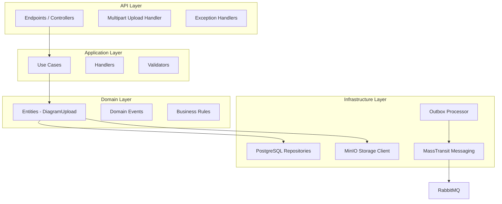
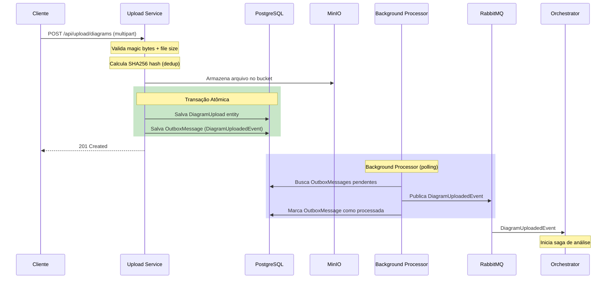
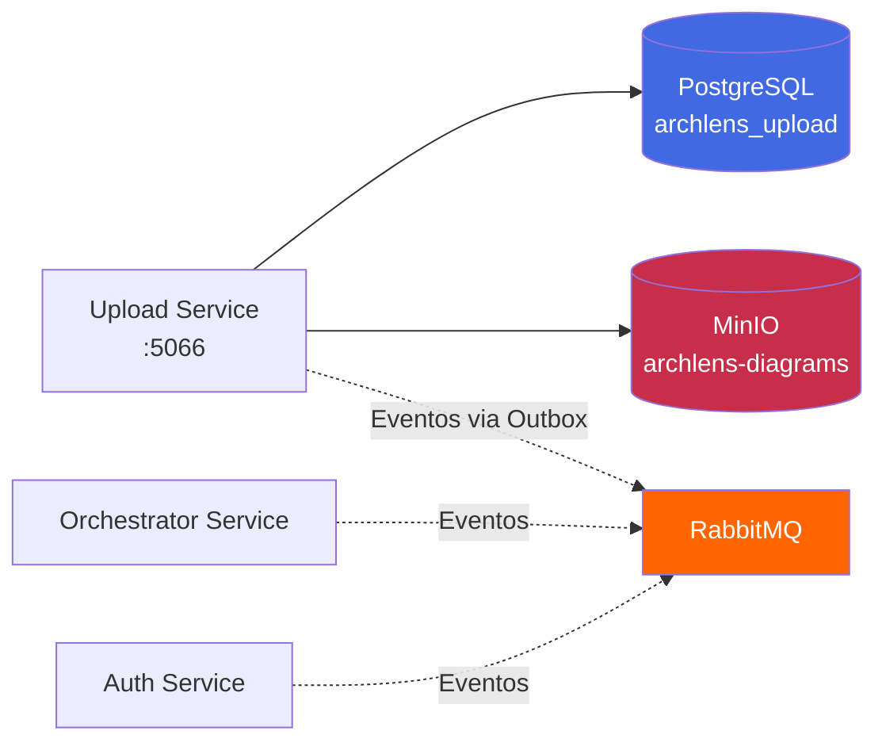
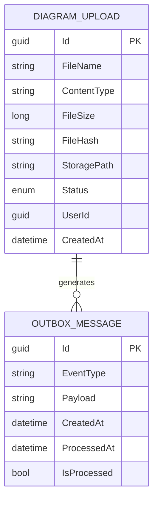
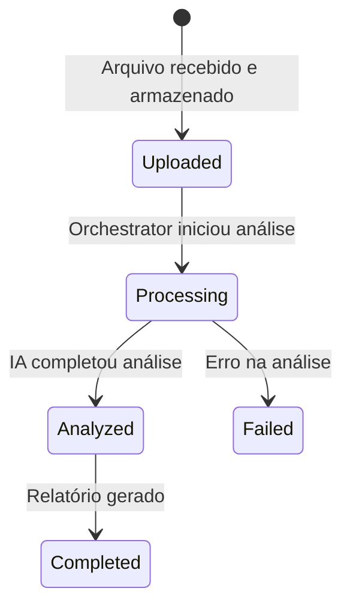
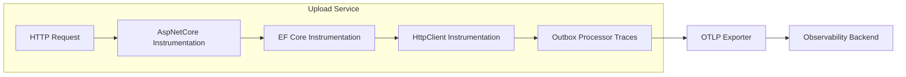

# ArchLens - Upload Service

[](https://github.com/archlens-platform/archlens-upload-service/actions/workflows/ci.yml)
[](https://sonarcloud.io/summary/new_code?id=archlens-platform_archlens-upload-service)
[](https://sonarcloud.io/summary/new_code?id=archlens-platform_archlens-upload-service)
[](https://sonarcloud.io/summary/new_code?id=archlens-platform_archlens-upload-service)
[](https://sonarcloud.io/summary/new_code?id=archlens-platform_archlens-upload-service)
[](https://sonarcloud.io/summary/new_code?id=archlens-platform_archlens-upload-service)
[](https://sonarcloud.io/summary/new_code?id=archlens-platform_archlens-upload-service)
[](https://sonarcloud.io/summary/new_code?id=archlens-platform_archlens-upload-service)

> **Microsserviço de Upload e Gestão de Diagramas Arquiteturais**
> Hackathon FIAP - Fase 5 | Pós-Tech Software Architecture + IA para Devs
>
> **Autor:** Rafael Henrique Barbosa Pereira (RM366243)

[](https://dotnet.microsoft.com/)
[](https://www.docker.com/)
[](https://blog.cleancoder.com/uncle-bob/2012/08/13/the-clean-architecture.html)
[](https://www.postgresql.org/)
[](https://min.io/)
[](https://www.rabbitmq.com/)

## 📋 Descrição

O **Upload Service** é o microsserviço responsável pelo recebimento, validação e armazenamento de diagramas arquiteturais no ecossistema ArchLens. Suporta upload de arquivos PNG, JPG e PDF com validação por **magic bytes**, deduplicação via **SHA256 hash**, e limite de tamanho. Implementa o **Outbox Pattern** para garantir entrega confiável de eventos de domínio — os eventos são salvos junto com a entidade na mesma transação e publicados por um background processor.

## 🏗️ Arquitetura

O projeto segue os princípios de **Clean Architecture**:



## 🔄 Outbox Pattern - Entrega Confiável de Eventos

Este serviço implementa o **Outbox Pattern** para garantir consistência entre o estado da entidade e a publicação de eventos:



## 🛠️ Tecnologias

| Tecnologia | Versão | Descrição |
|------------|--------|-----------|
| .NET | 9.0 | Framework principal |
| PostgreSQL | 17 | Banco de dados relacional |
| Entity Framework Core | 9.x | ORM para PostgreSQL |
| MinIO | latest | Object Storage S3-Compatible |
| MassTransit | 8.x | Message Broker abstraction |
| RabbitMQ | 3.x | Message Broker |
| OpenTelemetry | 1.x | Traces e Métricas |
| Serilog | 4.x | Logs Estruturados |
| Swagger/OpenAPI | 6.x | Documentação da API |

## 🔒 Isolamento de Banco de Dados

> ⚠️ **Requisito:** "Nenhum serviço pode acessar diretamente o banco de outro serviço."

Este serviço acessa **exclusivamente** seu próprio banco PostgreSQL (`archlens_upload`) e bucket MinIO (`archlens-diagrams`). A comunicação com outros serviços é feita **apenas via RabbitMQ (eventos)**:



**Eventos publicados:** `DiagramUploadedEvent` (via Outbox Pattern)
**Eventos consumidos:** `UserAccountDeletedEvent`

## 📁 Estrutura do Projeto

```
archlens-upload-service/
├── src/
│   ├── ArchLens.Upload.Api/                # API Layer
│   │   ├── Endpoints/                      # Minimal APIs
│   │   │   └── DiagramUploadEndpoints.cs   # Upload, List, Status
│   │   ├── Middlewares/                     # CorrelationId
│   │   └── Program.cs                      # Entry point (:5066)
│   │
│   ├── ArchLens.Upload.Application/        # Application Layer
│   │   ├── UseCases/                       # Commands/Queries
│   │   └── Validators/                     # File Validation
│   │
│   ├── ArchLens.Upload.Domain/             # Domain Layer
│   │   ├── Entities/                       # DiagramUpload, OutboxMessage
│   │   ├── Events/                         # DiagramUploadedEvent
│   │   └── Interfaces/                     # Contratos
│   │
│   └── ArchLens.Upload.Infrastructure/     # Infrastructure Layer
│       ├── Persistence/                    # EF Core + PostgreSQL
│       ├── Storage/                        # MinIO Client
│       ├── Outbox/                         # Outbox Processor (Background)
│       └── Messaging/                      # MassTransit Publishers
│
└── tests/
    └── ArchLens.Upload.Tests/              # Testes unitários e integração
```

## 🚀 Como Executar

### Pré-requisitos
- .NET 9.0 SDK
- Docker (para PostgreSQL, MinIO e RabbitMQ)

### Passos

```bash
# 1. Subir infraestrutura
docker-compose up -d postgres minio rabbitmq

# 2. Executar a API
dotnet run --project src/ArchLens.Upload.Api
```

A API estará disponível em: `http://localhost:5066`

## 📡 Endpoints

### Diagramas (`/api/upload/diagrams`)

| Método | Endpoint | Auth | Descrição |
|--------|----------|------|-----------|
| POST | `/api/upload/diagrams` | 🔐 JWT | Upload de diagrama (multipart/form-data) |
| GET | `/api/upload/diagrams` | 🔐 JWT | Listar diagramas (paginado) |
| GET | `/api/upload/diagrams/{id}/status` | 🔐 JWT | Consultar status do processamento |

### Validações de Upload

| Validação | Regra |
|-----------|-------|
| Formatos aceitos | PNG, JPG/JPEG, PDF |
| Magic Bytes | Validação binária do header do arquivo |
| Tamanho máximo | Configurável via settings |
| Deduplicação | SHA256 hash — rejeita arquivos duplicados |

### Exemplo de Upload

```bash
curl -X POST http://localhost:5066/api/upload/diagrams \
  -H "Authorization: Bearer <jwt-token>" \
  -F "file=@diagrama-arquitetura.png"
```

## 📊 Diagrama de Entidades



## 📈 Fluxo de Negócio



## 📨 Eventos do Saga

### Eventos Publicados (via Outbox)

| Evento | Quando | Payload |
|--------|--------|---------|
| `DiagramUploadedEvent` | Arquivo validado e armazenado com sucesso | DiagramId, FileName, StoragePath, UserId |

### Eventos Consumidos

| Evento | Ação |
|--------|------|
| `UserAccountDeletedEvent` | Remove diagramas do usuário (LGPD cascade) |

## 🧪 Testes

```bash
# Rodar todos os testes
dotnet test

# Rodar com cobertura
dotnet test --collect:"XPlat Code Coverage" --settings coverlet.runsettings

# Testes de integração (requer Docker)
dotnet test --filter "Category=Integration"
```

## 🔧 Configuração

### Variáveis de Ambiente

| Variável | Descrição |
|----------|-----------|
| `ConnectionStrings__DefaultConnection` | String de conexão PostgreSQL |
| `MinIO__Endpoint` | Endpoint do MinIO (ex: `localhost:9000`) |
| `MinIO__AccessKey` | Access Key do MinIO |
| `MinIO__SecretKey` | Secret Key do MinIO |
| `MinIO__BucketName` | Nome do bucket (`archlens-diagrams`) |
| `MinIO__UseSSL` | Usar SSL para conexão MinIO |
| `RabbitMQ__Host` | Host do RabbitMQ |
| `RabbitMQ__Username` | Usuário do RabbitMQ |
| `RabbitMQ__Password` | Senha do RabbitMQ |
| `Upload__MaxFileSizeBytes` | Tamanho máximo de arquivo |
| `OpenTelemetry__Endpoint` | Endpoint do OTLP Exporter |

## 🐳 Docker

```bash
docker build -t archlens-upload-service .
docker run -p 5066:8080 archlens-upload-service
```

## 📈 Observabilidade

O serviço possui integração completa com **OpenTelemetry** e **Serilog** para observabilidade:



**Instrumentações:**
- `AspNetCore` - Traces de requisições HTTP
- `EntityFrameworkCore` - Traces de operações PostgreSQL
- `HttpClient` - Traces de chamadas ao MinIO
- `MassTransit` - Traces de mensageria RabbitMQ

**Métricas:**
- Runtime (.NET metrics)
- Process (CPU, Memory)
- ASP.NET Core (requests, latência)
- Outbox (mensagens pendentes, processadas)

### Serilog (Logs Estruturados)

```json
{
  "Timestamp": "2026-03-15T00:00:00Z",
  "Level": "Information",
  "MessageTemplate": "Diagram {FileName} uploaded successfully with hash {FileHash}",
  "Properties": {
    "FileName": "architecture-diagram.png",
    "FileHash": "a1b2c3d4e5...",
    "FileSize": 245760,
    "UserId": "abc-123",
    "CorrelationId": "def-456",
    "ServiceName": "archlens-upload-service"
  }
}
```

---

FIAP - Pós-Tech Software Architecture + IA para Devs | Fase 5 - Hackathon (12SOAT + 6IADT)
